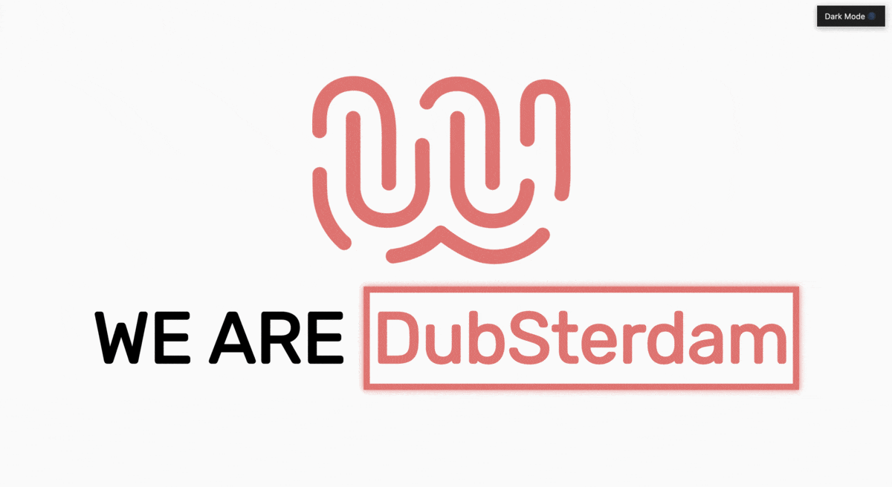

# We Are DubSterdam

 [](https://www.codefactor.io/repository/github/remrkabledev/dubsterdam-page)

A page that summarizes the trainees from the joint Amsterdam and Dublin campuses of Wild Code School. This page is an introduction and collection of the students and their projects made during the bootcamp.



This application is built with [React.js](https://reactjs.org/) and makes use of the [Context API](https://reactjs.org/docs/context.html).

## Getting Started

These instructions will get you a copy of the project up and running on your local machine for development and testing purposes. See deployment for notes on how to deploy the project on a live system.

### Prerequisites

What things you need to install the software and how to install them

```
NPM / Yarn
Code Editor (This app was built on VSCode)
Git
```

### Installing

To get this project on your local machine, you first need to clone it using the `git clone` command.

```
git clone https://github.com/reMRKableDev/dubsterdam-page.git
```

Running this on your terminal will ensure you receive the latest version with all it's changes.

Once you've cloned, navigate into the project folder and run

```
npm install
```

This should retrieve all the necessary dependencies named in the `package.json` file.

## Running the tests

This app utilizes Jest & Enzyme for testing the components. Tests can be run by using the command:

```
npm test

OR

npm run test
```

To run tests with coverage, use the command:

```
npm run coverage
```

## Contributing

When contributing to this repository, please first discuss the change you wish to make via issue, email, or any other method with the owners of this repository before making a change.

Please note that there is a code of conduct, please follow it in all your interactions with the project.

1. Ensure any install or build dependencies are removed before the end of the layer when doing a build.

2. Update the README.md with details of changes to the interface, this includes new environment variables, exposed ports, useful file locations and container parameters.

## Authors

- **Malcolm R. Kente** - _Initial work_ - [reMRKable Dev](https://remrkabledev.com/)

## Acknowledgments

This project was bootstrapped with [Create React App](https://github.com/facebook/create-react-app).
